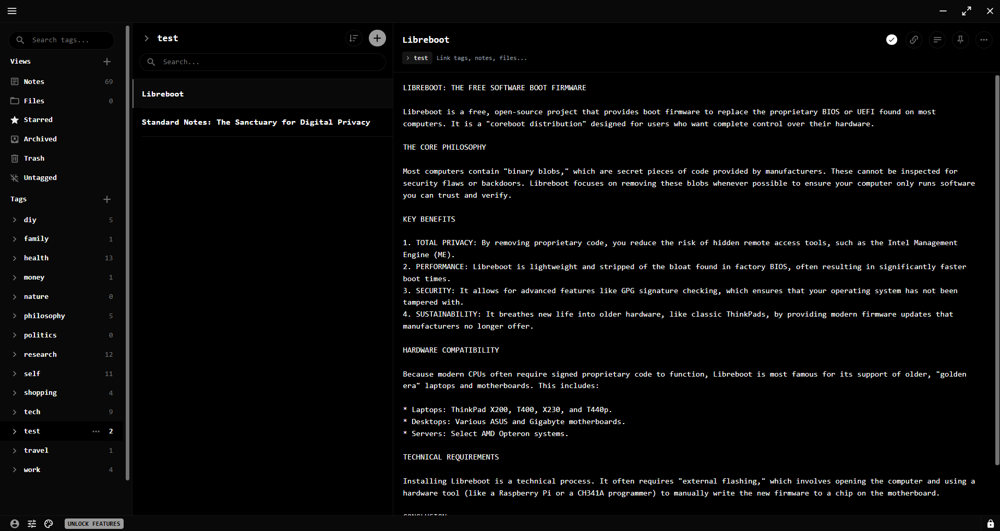

# Dark Lights Out - Standard Notes Theme

A pure black minimalist theme for Standard Notes with monospace font everywhere.



## Features

- 🖤 **True black background** (#000000) - Perfect for OLED screens
- 🔤 **Monospace font everywhere** - Clean, consistent typography
- 📱 **Mobile optimized** - Works perfectly on iOS and Android
- ⚡ **Minimal and fast** - No bloat, just clean design
- 🌙 **Easy on the eyes** - Designed for long writing sessions

## Installation

### Desktop & Mobile

1. Open Standard Notes
2. Go to **Settings** → **Plugins**
3. Scroll down to **Install Custom Plugin**
4. Paste this URL:
```
https://cdn.jsdelivr.net/gh/osrobin/dark-lights-out-standard-note-theme@main/ext.json
```

5. Click **Install**
6. Select "Lights Out" from the appearance menu

## Color Palette

| Color | Hex | Usage |
|-------|-----|-------|
| True Black | `#000000` | Primary background |
| Off Black | `#090909` | Secondary background |
| Dark Gray | `#151515` | Borders |
| Mid Gray | `#737373` | Secondary text |
| Light Gray | `#9C9C9C` | Interactive elements |
| White | `#FFFFFF` | Primary text |

## Typography

The theme uses your system's default monospace font:
- **Android**: Roboto Mono / Droid Sans Mono
- **iOS/macOS**: SF Mono / Menlo
- **Windows**: Consolas / Courier New
- **Linux**: DejaVu Sans Mono / Liberation Mono

## Development

Want to modify this theme?

1. Fork this repository
2. Edit `src/main.css`
3. Update version in `ext.json` and `package.json`
4. Commit and push
5. Wait 1-2 minutes for jsDelivr CDN to update
6. Reinstall using your fork's URL


## License

MIT License - Feel free to use and modify!

---

**Enjoying this theme?** ⭐ Star this repo!

**Issues or suggestions?** Open an issue on GitHub.
